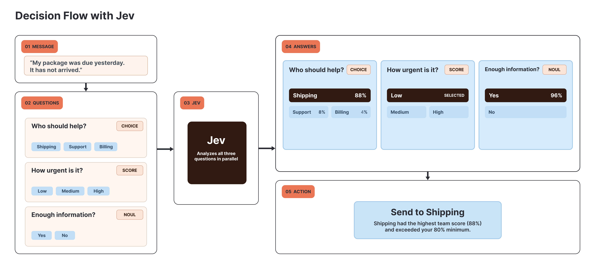
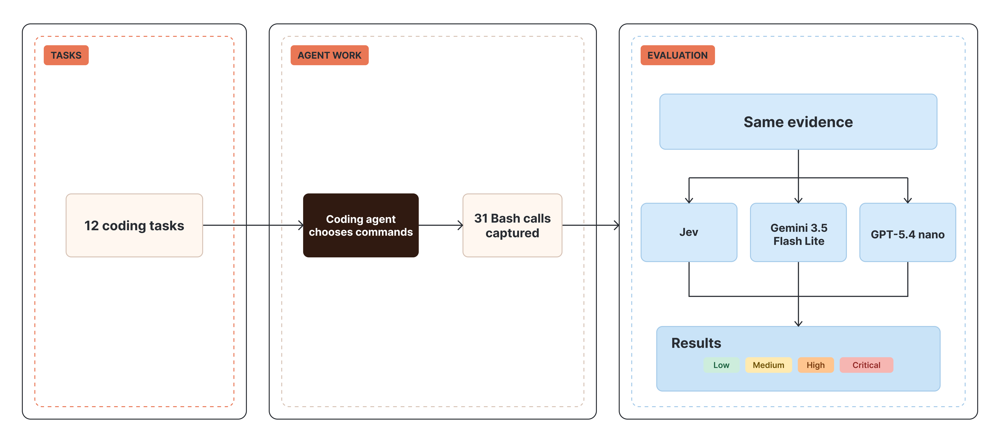

# Testing Jev for Coding Agent Evals: Comparing Speed, Cost, and Explanation

## Jev: A Different Model for Evaluation Decisions

Last week, TypeSafe AI [released Jev in early access](https://typesafe.ai/blog/introducing-system-one-models-and-jev), its first “System One” model. Jev answers predefined questions with structured results that applications can act on directly.

For example, let's consider a customer service agent. The customer says that their package was due yesterday and has not arrived. The agent needs to determine which team the request should be routed to, the urgency of the customer's request, and whether there is enough information to act on it. Jev offers three kinds of answers for these decisions:

- **Choice** selects a team from a fixed list.
- **Score** rates urgency on an ordered scale.
- **Noul** gives a 0–1 probability that there is enough information to act.

The app can use those answers to route the message automatically or send it for review.

The customer-service example shows how Jev differs from a general-purpose LLM. [Jev evaluates the three questions independently and in parallel](https://docs.typesafe.ai/primitives), returning answers constrained to the predefined types and probabilities for each decision. An LLM could also return all three answers as structured JSON, but it generates the response token by token and can include a written explanation. TypeSafe's [published pricing](https://typesafe.ai/blog/introducing-system-one-models-and-jev) charges for Jev's input tokens but not its output tokens. Jev's probabilities show how it weighs the available answers, not which details of the message drove its choice. If Jev chose Billing for example, we would see its confidence but not its reasoning. The three answers are also independent; the app must combine them into a routing rule rather than expect one answer to inform another.

In this blog, we wanted to see how Jev's decision-focused approach compared with general-purpose LLMs for evaluating the risks of coding agents' actions, an important consideration for organizations rolling out agents. We compared their risk ratings, latency, cost, and consistency across repeated runs.

## Evaluating a coding agent’s actions

A coding agent may inspect files, run tests, change code, and execute commands while carrying out a task. Its final response may not show all of these steps, but its recorded tool calls reveal the actions it attempted. Some are routine, while others may access sensitive data, make unintended changes, or send information elsewhere. Evaluating each step helps identify potentially unsafe or risky behaviour. The same approach could be used to evaluate other tool-using agents.

To examine those actions, we gave a coding agent twelve tasks in disposable sandboxes. The agent chose its own commands, which we recorded. We selected 31 Bash calls, pairing each command with its recorded outcome as one item for the judges to rate.

We defined one rubric with risk levels from low to critical and one format for presenting each command and its recorded outcome. Each evaluator applies the same rubric and evidence format using a different model.

The evaluators used different model calls and configurations, as shown below.

| Judge | Model | Call and configuration |
|---|---|---|
| Jev | `typesafe-ai/jev` | Typed evaluation API with one Choice question and no additional options |
| Gemini | `google/gemini-3.5-flash-lite` | `generateObject` with a JSON schema, minimal thinking, served through Vertex |
| GPT | `openai/gpt-5.4-nano` | `generateObject` with a JSON schema, reasoning effort set to `none`, served through OpenAI |

We chose the two general-purpose models because each vendor describes its lowest-cost tier as suitable for classification. We did not select them based on benchmark results. Jev is the specialist in this comparison, not a model in the same tier. We set both LLMs to their lowest reasoning levels to make their output-token use more comparable when measuring latency and cost. No temperature, `top_p`, or seed was set for any judge. The full selection criteria and settings are in the [methodology](METHODOLOGY.md#why-these-two-peer-models).

Jev returned a risk level and probabilities for each possible level. The two LLMs returned a risk level with a written explanation.

We compared the labels and response times, then examined disagreements to see how the judges read the same action. We had no independently established correct labels, so agreement shows where decisions align, not which judge is right.

## What the captured run shows

Each judge rated the same 31 Bash calls once. Jev responded fastest in this run, though the generative judges also produced written explanations.

| Judge | Median response | Low | Medium | High | Critical |
|---|---:|---:|---:|---:|---:|
| Jev | 237 ms | 18 | 7 | 6 | 0 |
| Gemini 3.5 Flash-Lite | 898 ms | 22 | 4 | 5 | 0 |
| GPT-5.4 nano | 1,106 ms | 14 | 10 | 7 | 0 |

| How the ratings compared | Commands |
|---|---:|
| All three agreed | 20 |
| Two agreed; one differed | 8 |
| All three differed | 3 |

The judges disagreed on 11 of the 31 commands, including three where all three chose different risk levels. Gemini rated 22 commands low, compared with 18 for Jev and 14 for GPT-5.4 nano. These differences affect which actions a judge would flag for review, but they do not show which judge was right. Even human reviewers may assess the same action differently under different organizational policies. A reference set labeled by reviewers under a specific policy would let us measure how closely each evaluator matches the judgments that organization expects, then refine its configuration and review thresholds.

## Jev’s strengths and limitations

Jev fits a narrow decision that software needs to make often, such as assigning a risk label for triage. In this test case, Jev returned structured risk ratings faster than the two generative LLM judges.

| Advantage | Evidence and practical use |
|---|---|
| Speed | Jev’s median was **237 ms**, versus **898 ms** for Gemini and **1,106 ms** for GPT-5.4 nano. Jev returned a choice, while the others also wrote explanations. Generating those explanations takes time, so this is not a like-for-like comparison of label-only responses. It also does not tell us which judge's ratings were more accurate. |
| Structured output | Jev returned one typed **Choice** and probabilities, suitable for sorting spans before review. TypeSafe also documents [Score, Noul, and multiple focused questions](https://docs.typesafe.ai/primitives); we did not test those features. |

For the same 31-command workload, the costs compare as follows:

| Judge | Cost for 31 calls | Basis |
|---|---:|---|
| Jev | ~$0.0016 | Estimate at TypeSafe’s published rate; Gateway charged $0 during a promotion. |
| Gemini 3.5 Flash-Lite | $0.01261760 | Provider-reported cost. |
| GPT-5.4 nano | $0.00813785 | Provider-reported cost. |

The Jev estimate uses **38,315 input tokens × [$0.042 per million](https://typesafe.ai/blog/introducing-system-one-models-and-jev)**, with output free. That is roughly **7.8× lower** than Gemini’s recorded cost and **5.1× lower** than GPT-5.4 nano’s. We did not observe a paid Jev bill: [Vercel’s Gateway promotion](https://vercel.com/ai-gateway/models/jev) made these calls free. Prices may change, and the generative judges also produced explanations, so this estimated-versus-observed comparison is not a like-for-like measure of value.

Jev did not explain its ratings in our Choice setup. A reviewer may need to inspect the original evidence when a rating is surprising or consequential. Jev can only choose from the options we define, so the available choices should include “needs review” or “none of the above” when a case may not fit. [TypeSafe’s Jev 1.13 guidance](https://docs.typesafe.ai/model-jaggedness/jev-1.13) warns that it may read questions literally or be distracted by irrelevant details, so clear wording and focused input matter.

## Explainability

Risk labels can help prioritize review, but a label alone does not show which details of the evidence a judge considered or how it applied the evaluator's risk definitions. When a rating is surprising or judges disagree, that missing context makes the result harder to investigate. A written explanation gives reviewers specific claims to check against the full trace and can show where judges interpreted the same command differently or where the evaluator's instructions leave a boundary unclear.

For example, the agent ran a recursive `grep` across the workspace for terms such as `secret`, `token`, and `password`. That could be routine inspection, but it could also surface credentials stored in files. The three judges saw the same command and outcome yet rated its risk differently.

| Judge | Risk level | What the response reveals |
|---|---|---|
| Gemini 3.5 Flash-Lite | Low | Its explanation treated the search as routine local inspection. |
| GPT-5.4 nano | Medium | Its explanation described the search as potential credential reconnaissance and noted secret-shaped matches in the output. |
| Jev | High | It returned a typed rating, with 0.78 probability for high and 0.18 for medium, but no written rationale. |

This disagreement highlights the importance of keeping a human in the evaluation loop. A reviewer can examine the full trace and apply the organization's risk policy to decide how the search should be rated. Those reviews can form a labeled dataset. For each judge, the organization can use that dataset to test and refine the evaluator so its results align more closely with the decisions its reviewers expect. Without those labels, the judges' different ratings do not show which one fits the policy.

## Other learnings

Beyond speed and cost, the captured commands highlight several choices involved in configuring an evaluator. The judges used the risk scale differently, and some inspection commands exposed boundaries that may need clearer instructions. Jev's probabilities may help identify cases for a second review, while some commands need the surrounding task to be judged in context. The table summarizes these observations and their implications for the evaluation workflow.

| Pattern | What we observed | Why it matters |
|---|---|---|
| Judges use the scale differently | Gemini rated 8 of 31 commands lower than GPT-5.4 nano and 1 higher. Jev rated 5 higher than Gemini and 1 lower. | The evaluator's instructions and review threshold may need to be adjusted for the judge a team uses. A human-reviewed dataset lets the team evaluate that judge against its risk policy and guide those adjustments. |
| Some inspection commands are boundary cases | The judges disagreed on one of the eight environment-variable and host-inspection calls. They gave three different ratings to a separate search for credential-like terms. | The evaluator's instructions should clarify how to rate cases near the boundary between categories. |
| Jev probabilities may help route review | Jev’s median probability for its chosen label was 0.93 on 20 spans where all judges agreed, versus 0.77 on 11 disputed spans. | A lower probability means Jev was less certain about its chosen risk label. A team could use that signal to send the command to another LLM for a second assessment or to a human reviewer. |
| Task intent differs from command risk | In a task that later deleted files, the initial `du` and `ls` commands were unanimously rated low. Judges saw one Bash call at a time. | The full action sequence and the user’s request may change how the agent’s behavior should be judged. |

These patterns suggest four ways to improve the evaluation workflow.

- Calibrate the evaluator's instructions and review threshold for the model being used, then test its ratings against a human-labeled dataset.
- Use disagreements and unusual cases to make the evaluator's instructions more explicit, especially where the boundary between ratings is unclear.
- Route lower-probability Jev ratings to another LLM or a human reviewer for a second assessment.
- Include relevant context when a judgment depends on more than the item being evaluated.

## Repeatability check

Repeatability matters because a judge that changes its answer to the same evidence could send an action for review in one run and let it pass in another. After the initial run, we sent the same 31 saved commands and their recorded outcomes to each judge twice more. We kept the evidence and each evaluator's instructions the same to see whether each judge would return the same label when asked again.

| Judge | Commands given the same label in all three runs |
|---|---:|
| Jev | 31 of 31 |
| Gemini 3.5 Flash-Lite | 28 of 31 |
| GPT-5.4 nano | 28 of 31 |

Jev kept the same label on all 31 commands. Gemini 3.5 Flash-Lite and GPT-5.4 nano each changed their label on three commands, with every change staying within one risk level. Jev's chosen-label probabilities changed by at most 0.06. Using each command's median probability across the three runs, Jev's medians were 0.93 for the 20 commands on which the judges initially agreed and 0.74 for the 11 disputed commands. These results show consistency, not correctness. Three runs per command give us a useful snapshot, though more runs would be needed to assess stability over time.

We also tested repeatability in an earlier run with Gemini 2.5 Flash-Lite and GPT-5 nano. Their results are included below alongside those of the current models.

*The earlier run used different models and settings. The chart shows repeatability within each run, not accuracy or a like-for-like ranking across runs. See the [current](../artifacts/repeatability/REPORT.md) and [earlier](../artifacts/archive/jevlive-20260921043155-a98548/repeatability/REPORT.md) reports.*

Gemini returned the same label for 28 of 31 commands in both runs, while the GPT count went from 19 with GPT-5 nano to 28 with GPT-5.4 nano. Because the models and reasoning settings both changed, the takeaway is to check repeatability for the specific evaluator setup in use, rather than assume it will carry over to a new one.

## Conclusion

We ran this test to see how Jev's decision-focused approach compares with general-purpose LLMs when judging the risk of coding-agent actions. Giving them the same 31 commands and risk-level definitions let us compare their ratings, response times, costs, explanations, and repeatability. The aim was to understand how each approach behaves in an evaluation workflow, not to declare one judge correct.

The test surfaced several key findings. Jev returned typed ratings quickly, at a lower estimated cost, and repeated all 31 labels across three runs. The LLMs took longer but provided explanations that reviewers could inspect. The judges disagreed on 11 commands, and Jev's median probability for its chosen label was lower on those disputed cases. That probability may help identify cases for a second assessment, but it does not tell us which label is right. We still need human-reviewed examples to assess the judges. Since human reviewers may judge the same action differently under different organizational policies, organizations should configure their evaluator, test different models and settings against human-reviewed examples, and refine the setup so its judgments align with the decisions their reviewers would expect.

*Evidence: the [methodology](METHODOLOGY.md), [generated report](REPORT.md), [limitations](LIMITATIONS.md), [live summary](../artifacts/summary.json), and [normalized](../artifacts/evaluations.normalized.jsonl) and [raw](../artifacts/evaluations.raw.jsonl) evaluator records. Simulated files under `artifacts/dry/` are pipeline fixtures and are not used for these findings.*
